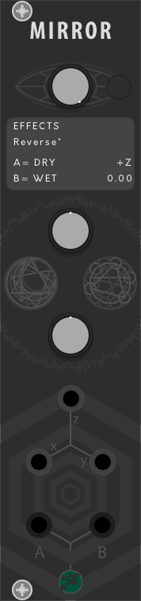

# Ability

Ability is a multi-algorithm module.

## Quickstart Guide

 

### Controls
1. <b>Control Knob</b>: to control the algorithms category
2. <b>Alt. button</b>: to activate the alternative output mode
3. <b>Mod knob</b>: to control the algorithm
4. <b>Z knob</b>: multifunctional parameter
5. <b>x,y,z</b>: inputs
6. <b>A,B</b>: outputs

<b>Notes</b> 
The <b>*</b> character near an algorithm title remind you that there's an alternative output. 
If the functionality of an input or a parameter it's not specified then it's a temporary useless variable. 

## UTILITIES
### 1. Inverter
A= -x;  
B= -y;
### 2. Half-Wave Rectifier
A= positive values for x; 
B= positive values for y;
### 3. Full-Wave Rectifier*
A= |x|; 
B= |y|; 
<b>Alternative outputs</b>: 
A= |x+y|; 
B= |x-y|;
### 4. Quantizer
A= round(x); 
B= round(y);
### 5. Slew Limiter
Z: shape; 
z: signal input; 
x: rise; 
y: fall; 
A= out; 
B= -out;
### 6. Dual VCA*
z: cv input; 
A= cv_linear * x; 
B= cv_linear * y; 
<b>Alternative outputs</b>: 
A= cv_exponential * x; 
B= cv_exponential * y;

## LOGIC
### 1. Min-Max
A= min;  
B= max;
### 2. Logic 1*
Z: [-5,5]; 
z: cv input; 
A= x+y+z; 
B= x-y-z; 
<b>Alternative outputs</b>: 
A= x+z; 
B= y-z;
### 3. Logic 2*
Z: [-5,5]; 
z: cv input; 
A= x * y + z; 
B= x / y + z; 
<b>Alternative outputs</b>: 
A= x * z; 
B= y * z;
### 4. Logic 3*
Z: [-5,5]; 
z: cv input; 
A= x * y * z; 
B= x * y ^ z; 
<b>Alternative outputs</b>: 
A= x^z; 
B= y^z;
### 5. Logic Ports*
Z: [-1,1]; 
z: cv input; 
When Z+z >= 1 the not port is active; 
x: true when >=1; 
y: true when >=1; 
A= AND; 
B= OR; 
<b>Alternative outputs</b>: 
A= XOR; 
B= XNOR;

## SAMPLER
### 1. Sample & Hold
z: trigger input; 
x: noise threshold; 
y: noise threshold; 
When x and y are not connected noise generates between [-5,+5]
A= noise; 
B= noise sample;
### 2. Dual S&H
z: trigger input; 
x: signal input; 
y: signal input; 
A= x sample; 
B= y sample;

