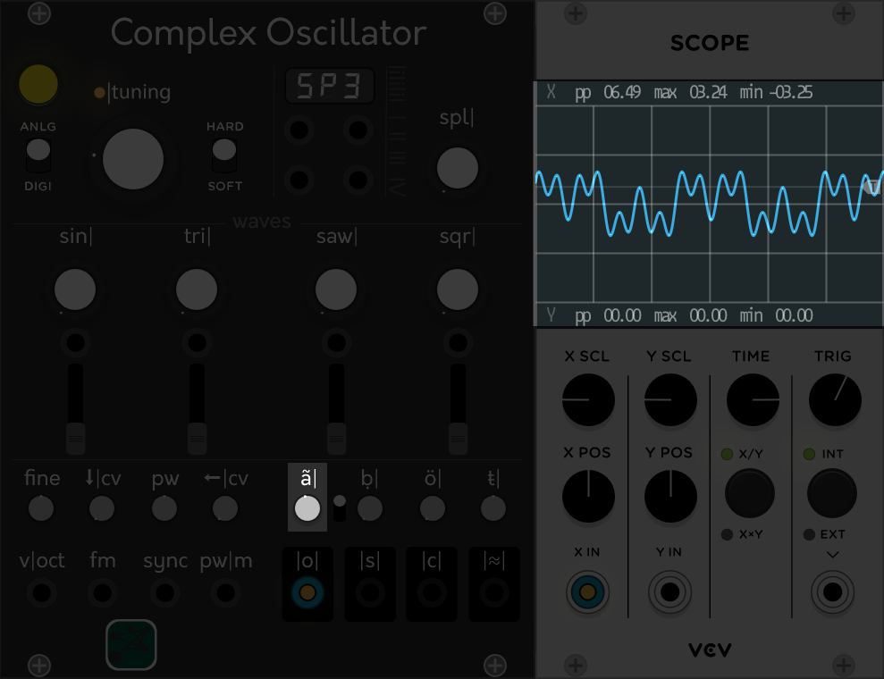

# Complex Oscillator

Let's figure out how it works.

## Quickstart Guide

  
<b>I'm starting analyzing the |o| output.</b>   
  
<b>first of all let's set ö| to zero, so we can see the source signal... the carrier that will be modulated 
the first wave it's a sine, let's take a look to the others...</b>  
  
<b>pay attention: I'm moving the ã| knob to chose the carrier</b>  
 
 
 
 
  
<b>those are all the waves you can "modulate", but replaced it's the right term.</b>  
  
<b>I'm using the sine because it's the most efficient waves to explain this thing, 
just divide the signal in four stages, by the pole and by the trend... 
in other terms have a visual of the signal when it's positive/negative and when it's rising/falling, 
I called those stage, that you see on a sine, I,II,III,IV</b>  
  
<b>the switch near ḅ| it's used to chose the stage and the wave, choosen with knob ḅ|, will replace the carrier 
first position - stage I</b>  
  
<b>second position - stage III</b>  
  
<b>third position - stage II</b>  
  
<b>fourth position - stage IV</b><br 
  
<b>now we can really see how the ö| knob works</b>  
 
  
<b>it's just a blend</b>  
  
<b>the ŧ| parameter allow you to change the staring phase of the special waves, it means that if you're using one of them as carrier moving the ŧ| will move also the stages. 
Remember that if the carrier it's a sine there are just 4 stages but if it's a special waves those 4 stages can be repated more then a once in the same period.</b>  
  
<b>At this point you should have clear ideas also on how modulation works.</b>
