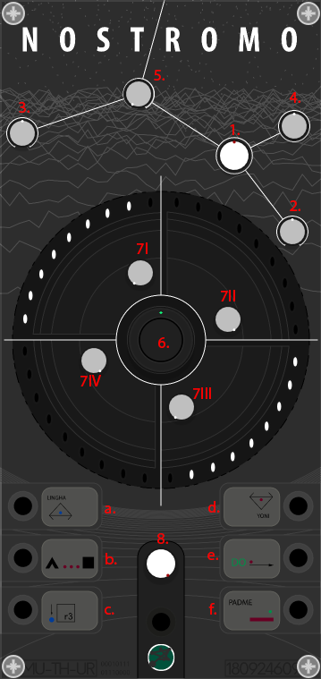

# Nostromo

Nostromo is a complex oscillator, a lighter version of the Complex Oscillator module.

## Quickstart Guide

 

### Controls
1. <b>Tuning knob</b>: oscillator frequency
2. <b>PW knob</b>: pulse width simmetry
3. <b>Theta knob</b>: to modulate the starting phase of the special waves 
4. <b>Sub Wave selector</b>: triangle, saw, square
5. <b>Sub Wabe amount</b>: from 0 to 100%
6. <b>Alpha knob</b>: to select the carrier
7. <b>Beta Stage knobs</b>: to select the signals for modulation
8. <b>Omega knob</b>: Dry/Wet control  
a. <b>V/OCT</b>: input 
b. <b>PW modulation</b>: input 
c. <b>Frequency modulation</b>: input 
d. <b>Theta modulation</b>: input 
e. <b>Omega modulation</b>: input 
f. <b>Alpha modulation</b>: input 

for more info look<a href="../QSG/complexoscillator/readme.md">here</a>
