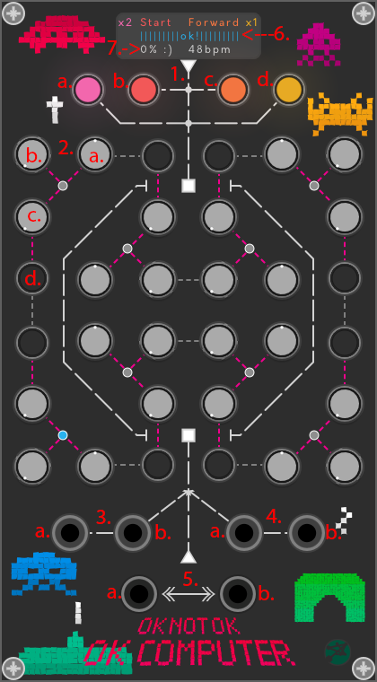

# OKNOTOK

OKNOTOK is a matrix step sequencer influenced by probability.

## Quickstart Guide

 

### Controls
1. <b>Command strip</b>:
  - <b>a</b>: Overclock Rate
  - <b>b</b>: Start/Stop
  - <b>c</b>: Forward/Reverse/Random 
  - <b>d</b>: Voltage Range
2. <b>Step Settings</b>: 
  - <b>a</b>: Voltage [-1,1]xVoltage Range
  - <b>b</b>: Probability Knob Voltage-Input(Saved) Voltage
  - <b>c</b>: Overclocking Probability
  - <b>d</b>: Trigger On/Off
3. <b>Input Section</b>:  
  - <b>a</b>: Clock Input 
  - <b>b</b>: Voltage Input (saved on current step)
4. <b>Trigger In Section</b>: 
  - <b>a</b>: Start/Stop 
  - <b>b</b>: Reset
5. <b>Output Section</b>: 
  - <b>a</b>: Voltage
  - <b>b</b>: Trigger
6. <b>State Status</b>: [ok, notok, error]
7. <b>Overload Status</b>: more the overclocking more the issues

### Behaviour

OKNOTOK has an internal clock, the clock input it's useful to put in sync the internal clock with an external clock bpm but impulses could not be perfectly synced. 
The internal clock can be overclocked,accelerated or slowed down, by overcloking knobs step by step. 
Turning the overclock knob to 1 means having a 100% chance of overclocked step. 
Overcloking knobs also add overload to the sequencer. 
Every step has also a probability knob to have a chance for switching between the voltage selected by the knob and voltage saved from the input or, if a cable is connected, the input signal. 
Overload changes the behaviour of the sequencer. 
The voltage output, trigger output, overclock rate, voltage range, step modality will be influenced by overload. 

