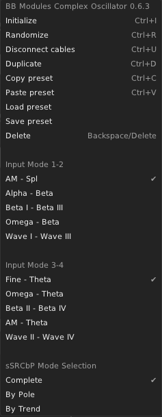

# BBModules

### Version
Developing version: 0.6.4  
Current version: 0.6.3  

<b>Updates 0.6.4</b> 
-Nostromo 
-Fixed: Reverse Algorithm 
-Added: FX Volume - Reverse Algorithm 
-New Graphic Design 
-Linux Build 
-Added: memory for Sequencer Algorithm 

<b>Updates 0.6.3</b> 
-New Graphic Design 
-Fox, Ability, Triverse, Bimix

### Notes
Soon my modules will be available on the VCV Store. 
All my modules are sold in a single package and all the updates and the future modules all granted with it.  
You can find at moment my modules to purchase <a href="https://gumroad.com/bbmodules">here</a>. 
Check my youtube <a href="https://www.youtube.com/channel/UCr-XgZjigmCxKmNMk75pRYQ?view_as=subscriber">channel</a> for more info and updates.

# My Modules

<a href="/QSG/fox/readme.md">Quickstart Guide</a> 

<a href="/QSG/ability/readme.md">Quickstart Guide</a> 

Inspired to <a href="https://intellijel.com/shop/eurorack/mixup/">Mixup</a> by Intellijel 

Inspired to <a href="https://intellijel.com/shop/eurorack/triatt/">Triatt</a> by Intellijel 

 
Inspired to <a href="https://intellijel.com/shop/eurorack/quad-vca/">Quad VCA</a> by Intellijel 

<a href="">Quickstart Guide</a> 

<a href="/QSG/complexoscillator/readme.md">Q</a> 
