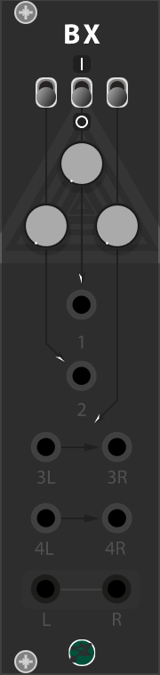

# BBModules

### Version
```
Developing version:  [1.0.0]
Current version: [1.0.0], [0.6.4] 
```

### Roadmap
```
Migrate to the VCV Store
Mirror: Autoswell, Looper
Yggdrasill
```

### Update Log

<b>1.0.0</b><br>
```
Nostromo has replaced the Complex Oscillator
Changed: Theta knob to Fine knob for Nostromo
```
<b>0.6.4</b><br>
```
Nostromo
Fixed: Reverse Algorithm
Added: FX Volume - Reverse Algorithm
New Graphic Design
Linux Build
Added: memory for Sequencer Algorithm
```
<b>0.6.3</b><br>
```
New Graphic Design
Fox, Ability, Triverse, Bimix
```
### Notes
```
All my modules are sold in a single package and all the updates and the future modules all granted with it.
```
Check my youtube <a href="https://www.youtube.com/channel/UCr-XgZjigmCxKmNMk75pRYQ?view_as=subscriber">channel</a> for more info and updates.

# My Modules


<a href="/QSG/fox/readme.md">Quickstart Guide</a><br>


<a href="/QSG/ability/readme.md">Quickstart Guide</a><br>


Inspired to <a href="https://intellijel.com/shop/eurorack/mixup/">Mixup</a> by Intellijel<br>


Inspired to <a href="https://intellijel.com/shop/eurorack/triatt/">Triatt</a> by Intellijel<br>

 
Inspired to <a href="https://intellijel.com/shop/eurorack/quad-vca/">Quad VCA</a> by Intellijel<br>


<a href="/QSG/nostromo/readme.md">Quickstart Guide</a><br>

## Discontinued


<a href="/QSG/complexoscillator/readme.md">Quickstart Guide</a><br>
