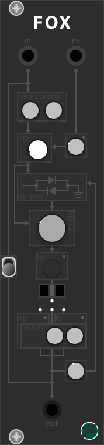

# BBModules

### Version
Developing version: 0.6.3  
Current version: 0.6.2b  

<b>Updates 0.6.3</b> 
-New Graphic Design 
-Fox, Ability, Triverse, Bimix

### Notes
You can find my modules to purchase <a href="https://gumroad.com/bbmodules">here</a>. 
Check my youtube <a href="https://www.youtube.com/channel/UCr-XgZjigmCxKmNMk75pRYQ?view_as=subscriber">channel</a> for more info.

# My Modules

 

 

<a href="/QSG/ability/readme.md">Quickstart Guide</a> 

Inspired to <a href="https://intellijel.com/shop/eurorack/triatt/">Triatt</a> by Intellijel 

Inspired to <a href="https://intellijel.com/shop/eurorack/mixup/">Mixup</a> by Intellijel 

 
Inspired to <a href="https://intellijel.com/shop/eurorack/quad-vca/">Quad VCA</a> by Intellijel 
